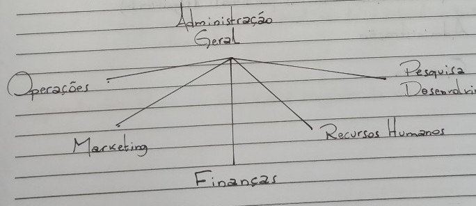
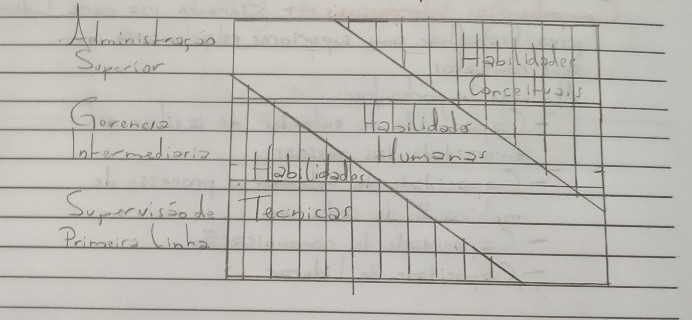
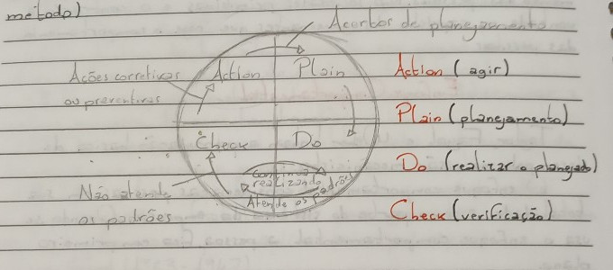
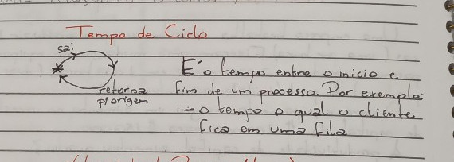
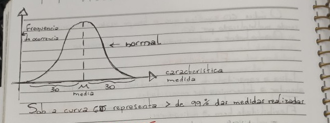

### Page 1

Introdução à Administração
Organizações e Administração

Principais componentes das organizações

1. Recursos
   Humanos
   Materiais
   Financeiro
   Espaço
   Tempo

2. Processo de transformação
   Divisão do trabalho

3. Objetivos

   Produtos
   Serviços

Input → Processo de transformação → Output
Ford

1ª, 2ª, 3ª, 4ª revoluções industriais

Principais processos organizacionais

Administração Geral

### Page 2

- Funções organizacionais e seus objetivos principais

  - Operações
  - Marketing
  - Pesq. e Desenv.
  - Finanças
  - Rec. Hum.

- Conceitos para avaliar o desempenho das organizações

  - Eficiência
    - Aproveitamento de recursos
  - Eficácia
    - Alinhamento do objetivo

- Administração e outras palavras (significado)
  - Administração
  - Gerencia

### Page 3

**Funções do Processo de Gestão**

**Planejamento** → É a ferramenta para administrar as relações com o futuro. O resultado é o plano.

**Organização** → Processo de dispor os recursos em uma estrutura que facilite a relação de objetivos. O resultado é a estrutura.

**Liderança** → Processo de trabalhar com pessoas para possibilitar a realização de objetivos. O resultado é coordenação, direção, motivação, comunicação e participação no trabalho em grupo.

**Execução** → Processo que consiste em realizar atividades planejadas por meio de energia física e mental.

**Controle** → Processo para assegurar a realização dos objetivos. O resultado é a comparação da realização x plano, realizando a retroalimentação (feedback).

**Gerente** → Pessoa que administra conjunto de recursos.

### Page 4

Planejamento ↔ Organização
↕ ↕ ↕
Controle ←→ Liderança ←→ Execução

---

- **Papeis de Informação**

  - Monitor
  - Disseminador
  - Porta Voz

- **Papeis Gerenciais e Papeis Interpessoais**

  - Líder
  - Figura de Proa
  - Ligação

- **Papeis de Decisão**
  - Adm. de Recursos
  - Negociador
  - Empreendedor
  - Controlador de Distúrbios

Por Henry Mintzberg

### Page 5

**Competências Intelectuais** → As habilidades intelectuais referem-se a todas as formas de raciocinar. O uso dessa habilidade faz com que se desenvolva a competência para elaborar conceitos, fazer análises, planejar, definir estratégias e formar decisões.

**Habilidade**:

- **Racional** → Trabalha na lógica sobre informações concretas.
- **Conceitual** → Pensamento abstrato, que não depende de informações concretas, intuição, imaginação e criatividade.

**Competências Interpessoais** → Gerente usa para liderar, para trabalhar com superiores, relacionar-se com seus contatos.
Algumas importantes:

- Capacidade de entender e aceitar a diversidade das pessoas.
- Capacidade de entender o processo de motivação de cada um.
- Capacidade de comunicação.
- Capacidade de liderar.

### Page 6

**Competência Técnica** → Abrange os conhecimentos sobre a atividade específica do gerente.
Por exemplo: se você é um administrador de um hospital, provavelmente você deve ser também da área médica.
Alguns trazem habilidades da sua formação, outros adquirem do próprio trabalho.

**Competência Intrapessoal** → Entendimento do próprio cargo, de seus requisitos e seu impacto sobre a organização.

- Capacidade de entender seu comportamento, em particular as emoções.
- Capacidade de entender o comportamento alheio, em particular as emoções alheias.
- Capacidade de superar sua própria vulnerabilidade.

### Page 7

**Maestro e Cirurgião**

O gerente como maestro é capaz de fazer as pessoas produzirem um resultado coletivo, utilizando suas técnicas. No entanto, as pessoas dirigidas são mais competentes tecnicamente que o maestro. Seu papel é dirigir e não executar a tarefa.

O gerente cirurgião está na ponta oposta. Ele é especialista no que gere. Desempenha ao mesmo tempo o papel técnico e é o chefe da equipe de ajudantes — exemplo: piloto que também é chefe da tripulação. Seu papel é fazer parte da operação ao mesmo tempo que chefia.

---

**30/08 - Teorias da Administração**
**Ideias Fundamentais**

Teoria é um conjunto de proposições que procuram explicar os fatos da realidade prática.
A partir do século XIX que a administração tornou-se um corpo organizado de conhecimentos ou teorias, assumindo o nome de disciplina.
As teorias da administração se organizaram em escolas e foram desenvolvidas para responder a questões específicas de seu tempo, contribuindo para administração moderna.
Maquiavel (1469-1527) teve muitas contribuições. Sua obra mais conhecida é _O Príncipe_, na qual faz recomendações sobre como um governante deve se comportar. Se tivesse vivido mais recentemente, muitas de suas ideias continuariam a ser endossadas.

### Page 8

- Maquiavel acreditava na importância do trabalho de equipe como o maior relevante no trabalho do dirigente
- A aprovação dos governados é essencial para o sucesso dos governantes
- Desde a publicação de _O Príncipe_ em 1513, se passaram quase 400 anos sem publicação de administração, que começou novamente no século XIX

- Taylor produziu o livro _Shop Management_ - Administração de Operações Fabris
  - I. O objetivo da boa administração era pagar salários altos e ter baixos custos de produção (fabricação)
  - II. Deveria aplicar métodos de pesquisa para determinar a melhor maneira de executar tarefas
  - III. Os empregados devem ser selecionados e treinados de maneira que pessoas e processos fossem compatíveis
  - IV. Deveria ter uma atmosfera íntima e cordial entre a administração e trabalhadores para garantir um ambiente psicológico favorável para aplicar esses princípios

**Henry Ford (1863-1947)**

- Peças e componentes padronizados e intercambiáveis. Na produção massificada, cada peça ou componente pode ser montado em qualquer produto.
- Especialização do trabalho. O produto é dividido em partes e os processos em etapas. Cada pessoa num sistema de produção deve ter uma tarefa fixa dentro de uma etapa do processo.

### Page 9

**Henry Fayol (1841-1925)**

- Falou muito no papel do dirigente.
- Fayol considerava a empresa uma atividade abstrata conduzida por um sistema racional de regras e autoridade, que justifica a sua existência quando atende o objetivo de fornecer valor.

**Max Weber (1864-1920)**

- Para Weber, a sociedade e as organizações são sistemas de normas impessoais. São as normas (ou leis) que regem o comportamento das pessoas. Nas sociedades primitivas, o controle é a vontade ou capricho dos governantes que regem o comportamento das pessoas.

---

**Enfoque Comportamental**

- Taylor, Fayol e Weber tinham a preocupação básica de desempenho na visão mecanicista.
- O enfoque comportamental considera as pessoas em sua totalidade e como parte do sistema da empresa. Quando se usa enfoque comportamental, a pessoa fica em primeiro plano.

---

**Pense Nisso**

- Qual sua opinião sobre os princípios de Taylor: a favor, contra ou neutro? Por quê?
- Os princípios de Taylor continuam atuais e válidos no mundo de hoje?
- Se fossem seriamente aplicados, o que mudaria nas organizações e na sociedade?

### Page 10

**La história del Ford T (vídeo)**

**Sistema Toyota de produção → Lean Production (produção enxuta) Lean Institute**

**Pesquisar Carlos Ghosn**

**Shewhart → Ciclo PDCA** (no EUA, no restante do mundo é conhecido como Ciclo Deming, que foi quem popularizou o método)

### Page 11

**Vídeo - Toyota: Produção Enxuta**  
13/09/24

- _Administração de Operações_
- Sistema Toyota de Produção
  - Automação
  - Controle de Inventário

**Eficiência** → É o aproveitamento dos recursos.

**Eficácia** → É atingir o objetivo. Só existe eficácia se houver objetivo.

**Produtividade** → É a relação:

- Output / Input

**Eficiência** → Matéria Prima Utilizada / Matéria Prima Disponível

---

Numa empresa a receita foi de 22 milhões e os custos necessários para a produção foram 20,9 milhões. Qual sua eficiência econômica?

Eᵉᶜ = (22 / 20,9) × 100 = **105,3%**

---

A eficiência econômica de uma indústria é 125%. A empresa faturou 240.000. Qual deve ser seus custos?

### Page 12

**Eficiência**

E = faturamento ÷ custos  
Faturamento = 240.000  
E = 1,25  
Custos = 240.000 ÷ 1,25 = **192.000**

---

Num processo produtivo geramos 9.900 kg de sucata a cada 10 toneladas de matéria-prima. Qual deve ser a eficiência da matéria-prima?

10.000 - 100 = 9.900 kg  
Ef.: 9.900 ÷ 10.000 × 100 = **99%**

---

Deveríamos ter percorrido hoje 1.200 km, mas em função do trânsito só conseguimos atingir 800 km. Qual foi a nossa eficiência?

Eficiência % = 800 ÷ 1.200 × 100 = **67%**

---

Deveríamos cursar 32 disciplinas em 3 anos de curso, mas só conseguimos cursar 20 disciplinas. Qual foi a eficácia?

Eficiência % = 20 ÷ 32 × 100 = **62,5%**

---

Ineficiência % = 100% - Eficiência % = 100 - 62,5 = **37,5%**

---

Sabe-se que em certo ano fiscal o faturamento foi de 40 milhões e para alcançá-lo foram utilizados 125 funcionários que trabalhavam em média 180h/mês. Qual deve ser a produtividade em homens/hora?

P = $40.000.000 ÷ (125 × 180 × 12) = **$105,78/h**

### Page 13

1 Mês = 4,3 semanas  
1 mês: 4,3 × 44 = 189,2 hs  
44 hs por semana  
52 semanas por ano

Sabe-se que no mesmo ano fiscal produziu-se 2 milhões de toneladas. Qual foi a produtividade em homens/hora?

P = 2.000.000 ÷ (125 × 180 × 12) = **5,29 t/h**

---

**Variação de produtividade**

Temos um negócio que fatura $50k por mês com 10 funcionários. Cada funcionário trabalha 160 horas/mês.  
Suponha que conseguimos treinar 10 funcionários para que eles produzam $60k por mês. Qual será a variação de produtividade em %?

Δ = (60 - 50) / 50 = **0,2 = 20%**  
10 Funcionários

Suponha que houve queda de faturamento de 50 mil para 30 mil. Qual será a variação de produtividade?

Δ = (30 - 50) / 50 = **-0,4 = -40%**

**Produtividade = produção ou faturamento / fator de produção**

### Page 14

**Produtividade de Fatores Isolado ou Parcial**

Podemos calcular a produtividade de fatores de produção isolados ou parciais, por quilowatt/hora, etc.
A soma das produtividades parciais não é igual a produtividade total.

| Saída (output) | $10.500 |
| Mão de Obra | $1.000 |
| Materiais | $3.000 |
| Capital | $2.500 |
| Energia | $300 |
| Outro | $200 |

**Produtividade isolada ou parcial:**

- **Mão de Obra**: 10.500 ÷ 1.000 = **10,5**
- **Materiais**: 10.500 ÷ 3.000 = **3,5**
- **Capital**: 10.500 ÷ 2.500 = **4,2**
- **Energia**: 10.500 ÷ 300 = **35**

### Page 15

| Outro | 10.500 ÷ 200 = 52,5 |

**Total**: 10.500  
1.000 + 3.000 + 2.500 + 300 + 200 = 7.000  
10.500 ÷ 7.000 = **1,5/t**

e ≠ de:  
10.500 ÷ 1.000 = 10,5  
10.500 ÷ 3.000 = 3,5  
10.500 ÷ 2.500 = 4,2  
10.500 ÷ 300 = 35  
10.500 ÷ 200 = 52,5

---

**Produtividade de Fatores Múltiplos**

Uma empresa trabalha 1.000 horas para produzir 1.000 peças (uma por hora). Fizeram uma mudança no equipamento e passou a produzir 2.000 peças em 1.000 horas (duas peças por hora). A produtividade aumentou 100%.

O novo equipamento exigiu um aumento no investimento de capital de $100.000 para $150.000.  
A produtividade de capital aumentou quanto?

P1:  
1.000 peças ÷ 100.000 = 0,01  
2.000 peças ÷ 150.000 = 0,0133  
Δ%: (0,0133 - 0,01) ÷ 0,01 = **33%**

---

A produtividade é uma das traduções mais conhecidas de eficiência e, às vezes, essas palavras são consideradas sinônimos, apesar de não serem.

### Page 16

**Produtividade e Qualidade Combinados**

Quando se medem, juntos, produtividade e qualidade, mede-se o **desempenho**, pois não se mede apenas a quantidade produzida em relação aos recursos, mas também dos produtos que são aproveitados em relação ao total fornecido.

- Produtividade: relação entre coisas iguais
- Eficiência: relação entre coisas diferentes

---

**Tempo de Ciclo**

É o tempo entre o início e o fim de um processo. Por exemplo: o tempo no qual o cliente fica em uma fila.

---

**Velocidade do Processo (taxa)**

É o tempo total consumido dividido pelo tempo usado para agregar valor.  
Por exemplo: suponha que você recebeu uma encomenda e demorou 6 semanas. Desse tempo, 4 horas foram efetivamente usadas para fazer o produto ou serviço e o restante foi perdido ou usado para outras finalidades.

Velocidade do processo = Tempo Total / Tempo Valor Agregado = 6 Semanas × 5 dias × 8h = 240h ÷ 4h = 60/h

### Page 17

O índice 60 significa que o tempo usado efetivamente está sendo multiplicado por 60.  
Quanto maior o índice, mais veloz é o processo.

**Flexibilidade**

Indica a capacidade de fornecer produtos customizados para atender a determinadas necessidades.  
Também é conhecido na manufatura como _manufatura ágil_.  
Flexibilidade tem 3 indicadores:

- Velocidade: mede a rapidez que a empresa consegue mudar seus produtos ou processos para fornecer produtos e serviços diferentes.
- Capacidade de atender grandes flutuações na demanda.
- Capacidade de fazer produtos diferentes simultaneamente.

---

**Seis Sigma**

Metodologia de redução de desperdícios pela eliminação de produtos defeituosos.  
Foca na análise de erros no produto, para consertar os problemas nos processos que o provocaram. É um conceito estatístico popularizado pela Motorola na década de 1980.  
A Motorola adotou a meta de 6σ para redução do desvio padrão em torno da média. O programa original considerava aceitável 3,4 defeitos por milhões de produtos ou serviços (3,4 ppm ou 0,00034%).

### Page 18

**DMAIC** (procedimento para 6σ)

Para implantar o 6σ usa-se o DMAIC:

- **D** → define → definir
- **M** → measure → medir
- **A** → analyse → analisar
- **I** → improve → melhorar
- **C** → control → controlar

- **Define** → selecionar o processo a ser analisado.
- **Measure** → fazer o levantamento detalhado dos dados de desempenho do processo a ser aprimorado.
- **Analyse** → análise para identificar oportunidades de aprimoramento.
- **Improve** → criar e implantar soluções para os problemas identificados.
- **Control** → acompanhar o desempenho do novo processo.

O **PDCA** é semelhante, entretanto é utilizado após o **DMAIC**.

### Page 19

**Satisfação dos Clientes**

É prioritário para todas as organizações.  
**EFQM** → Modelo de gestão da Fundação Europeia para Administração da Qualidade.  
**MBNQA** → Prêmio Nacional da Qualidade Malcolm Baldrige.

- Satisfação Manifesto dos Clientes
- Retenção (ou fidelização) de clientes
- Ganho de novos clientes
- Volume de reclamações
- Facilidade de acesso ao serviço de acesso aos clientes
- Repetição de negócios (ou retorno de clientes)

---

**Satisfação dos Acionistas**  
_ou partes interessadas (stakeholders)_

Satisfação dos acionistas é um conceito elástico. Podem ser proprietários, governos, fundos de pensão, pode ser ONU e seus organismos. Todos avaliam o desempenho: _Produtividade, Qualidade da organização_.

---

**P1 Prova**

- Cap. 1 Organizações e Adm
- Cap. 2 Teorias da Adm - Ideias Fundamentais
- Cap. 3 Teorias da Adm - Tendências (Contemporâneas)
- Cap. 4 Desempenho das Organizações

### Page 20

**Empresa competitiva** é aquela que consegue transformar um grande número de pessoas em seus clientes, obter lucro e sobreviver com isso.

---

**Desempenho das Organizações**

- Administração de alto desempenho ➡️ Eficiência no uso de recursos ➡️ Eficácia na realização de objetivos ➡️ Competitividade com desempenho superior aos concorrentes

---

**Critérios Para Avaliação de Desempenho**

- Satisfação dos acionistas
- Desempenho eficaz como negócio
- Satisfação dos clientes
- Qualidade dos produtos e serviços
- Eficiência no uso de recursos
- Satisfação dos funcionários

### Page 21

**Eliminar desperdícios agrega valor ao produto ou serviço**

---

**Agregação de Valor**  
Atividade que transforma recurso para atender a necessidade do cliente.

**Desperdícios**  
Atividade que consome recursos mas não agrega valor ao produto ou serviço.

---

Fator de Produção:
Produtividade =Produção/Recurso

---

**Desempenho**  
Produtividade e Qualidade simultaneamente.

---

**Ferramentas Para Aprimorar a Eficiência**

1. Estudar sistemicamente um processo ou atividade.
2. Identificar as incoerências e desperdícios.
3. Criar um processo ou atividade aprimorada.
4. Implementar e avaliar resultados.

### Page 22

**Reengenharia** → propõe a substituição radical dos processos ineficientes.

**Redesenho** → propõe aprimoramento contínuo de processos.

---

**Seis Sigma**

**Prêmio Europeu da Qualidade** → Desempenho final é avaliado pelos resultados e pelo impacto na sociedade.

**Balanced Scorecard** → O desempenho é avaliado por 4 resultados:

- Satisfação dos acionistas
- Satisfação dos clientes
- Eficiência dos recursos
- Aprendizado organizacional
