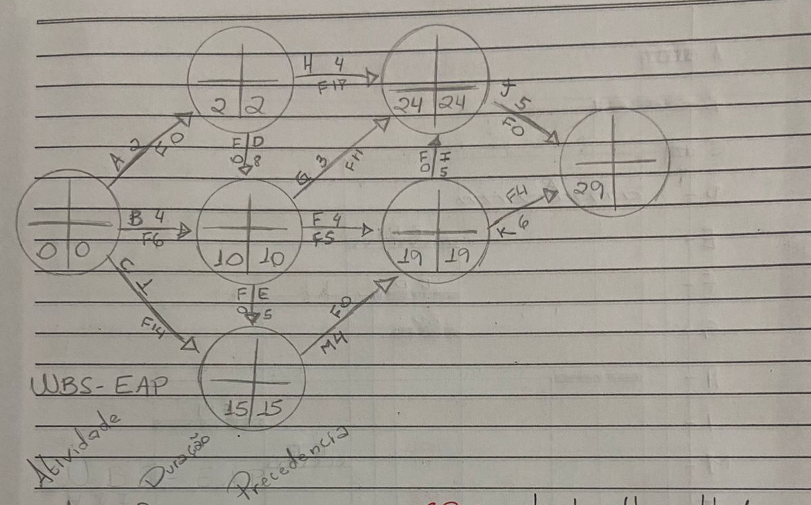
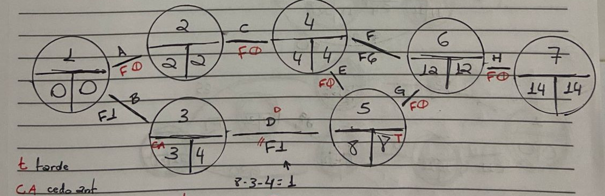

### Pag 0

Reengenharia → propõe a substituição radical dos processos ineficientes.

Redesenho do Processo → propõe aprimoramento contínuo.

Seis Sigma

Prêmio Europeu da Qualidade → Desempenho final é avaliado pelos resultados e pelo impacto na sociedade.

Balanced Scorecard
→ O desempenho é avaliado por 4 resultados:

    Satisfação dos acionistas
    Satisfação dos clientes
    Eficiência dos recursos
    Aprendizagem organizacional

### Pag 1

Geração de alternativas

Brainstorming

Criado por Alex Faickney Osborn

### Pag 2

Primeiramente os participantes precisam ser nivelados para ter um conhecimento prévio do que vão participar para conseguirem dar sugestões com propriedade.

A ferramenta trabalha com 2 princípios:

    Suspensão de Julgamento
    Reação em Cadeia

Como as pessoas não fazem críticas às ideias propostas, isso faz com que elas passem a fazer associação de ideias para gerar outras.

Quando o fluxo de ideias começa a se esgotar, para-se o processo.

Há um mediador cuja função é provocar a reação em cadeia.

Brainwriting

As pessoas interagem por escrito. Cada participante recebe uma folha de papel na qual anota suas ideias e sugestões. As folhas de papel são então trocadas aleatoriamente entre os participantes, de modo que possam ler e idear uns dos outros. A troca de folhas para quando se esgotam as ideias.

MDPO – Método de Delineamento de Problemas Organizacionais (ou Paradigma de Rubinstein)

Recurso que permite organizar em diagrama as relações de causa e efeito.

### Pag 3

Escolha de Alternativa

    Análise das Vantagens e Desvantagens
    Árvore de Decisão

08.11.24 – Planejamento Operacional

O processo de definir atividades e recursos chama-se planejamento operacional.

    Análise de Objetivos → que resultados devemos alcançar
    Planejamento de Atividades e do Tempo → o que deve ser feito e quando
    Planejamento de Recursos → quem fará e o quê, usando quais recursos
    Análise de Riscos → que condições podem ameaçar as atividades?
    Previsão de Meios de Controle → como saber se estamos no caminho certo.

EAP → Estrutura Analítica de Projeto
WBS → Work Breakdown Structure
Rede → Diagrama das atividades do projeto

### Pag 4

**WBS – EAP**

| Atividade | Duração | Precedentes |
| --------- | ------- | ----------- |
| A         | 2       | -           |
| B         | 4       | -           |
| C         | 7       | A           |
| D         | 8       | A           |
| E         | 5       | B, D        |
| F         | 4       | B, D        |
| G         | 3       | B, D        |
| H         | 4       | A           |
| I         | 5       | E, M        |
| J         | 5       | I, G, H     |
| K         | 6       | E, M        |
| M         | 4       | C, E        |

**Ida >**  
**Volta <**

---

**CPM** → Critical Path Method ou Método do Caminho Crítico

**PERT** → Program Evaluation Review Technique

---

### Pag 5

### Pag 6

Planejamento Estratégico

Usado nas organizações militares há muito tempo.
No século XX, o conceito de estratégia cresceu nas organizações empresariais. Peter Drucker foi um dos pioneiros com seu livro "A Prática da Administração" de 1955.

O conceito de estratégia nasceu na guerra, em que a realização de objetivos significa superar um concorrente que fica impedido de realizar os seus.

Fora da guerra, estratégia indica uma forma de enfrentar um problema ou uma forma de realizar objetivos.

Estratégia Empresarial

É o curso de ação que uma empresa adota para assegurar seu desempenho e sua sobrevivência.

As estratégias também são chamadas de políticas de negócios. As empresas concorrem em alguns negócios e colaboram em outros.

Negócio e Missão

Negócio define a área de atuação ou ramo de atividade que a empresa se dedica.
Missão estabelece a utilidade da organização para seus mercados e clientes e para a sociedade.

### Pag 7

**Estratégias**

- **Ansoff** → crescimento
- **Porter** → competitiva
- **Miles e Snow** → de adaptação ao ambiente
- **Certos** → estabilidade, crescimento e redução de despesas

**Matriz Ansoff**

|                 | Tradicional                | Novos                      |
| --------------- | -------------------------- | -------------------------- |
| **Tradicional** | Penetração no Mercado      | Desenvolvimento de Produto |
| **Novos**       | Desenvolvimento de Mercado | Diversificação             |

---

**Porter**

- Diferenciação
- Liderança do Custo
- Foco

---

**Miles e Snow**

- Comportamento Defensivo
- Prospectivo
- Analítico
- Reativo

### Pag 8

Aqui está a transcrição da imagem enviada:

---

**Project Libre**

**PMI** (Project Management Institute)  
**PMBOK** (Project Management Book Of Knowledge)  
**PMI Brasil** → pmi.org.brasil

---

Uma loja de departamentos decidiu reformar suas instalações. No entanto, para isso, precisa ficar fechada. O conselho de diretores estima que a empresa não suporta ficar mais de 15 dias fechada.

No final do projeto, teve um problema de acabamento que levou o projeto a um atraso de 3 semanas. Qual o impacto na duração do projeto?

---

| **Atividade** | **Precedência** | **Duração (Semanas)** |
| ------------- | --------------- | --------------------- |
| A             | -               | 2                     |
| B             | -               | 3                     |
| C             | A               | 4                     |
| D             | B               | 4                     |
| E             | C               | 2                     |
| F             | D, E            | 2                     |
| G             | F               | 2                     |

---

Legenda:

- **t** → Tarde
- **C.A.** → Cedo Anterior
- **D** → Duração
- **F** → Folga

Cálculo: **t = C.A. + D - F**

### Pag 9

"Uma empresa de software foi contratada para desenvolver um sistema contábil para uma clínica médica. Os contratantes estabeleceram uma multa contratual por atraso. Por isso, querem saber quanto tempo demanda para fazer o software. Acham que a atividade F julgou a precedência B de maneira muito conservadora, pois estas atividades poderiam ser feitas em paralelo. O que muda?"

| **Atividade** | **Precedência** | **Duração (Dias)** |
| ------------- | --------------- | ------------------ |
| A             | -               | 5                  |
| B             | -               | 5                  |
| C             | A               | 11                 |
| D             | B               | 7                  |
| E             | C               | 5                  |
| F             | B, D            | 9                  |
| G             | C               | 20                 |

---

